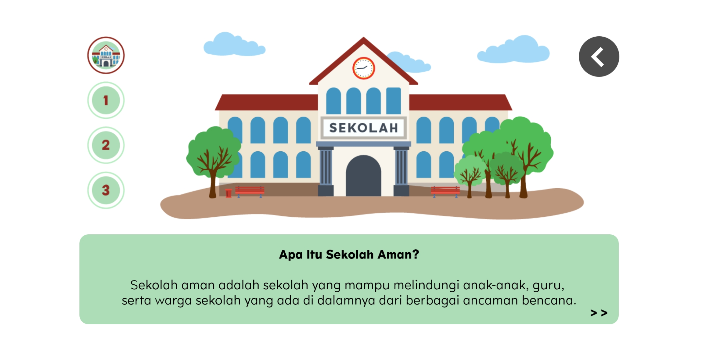
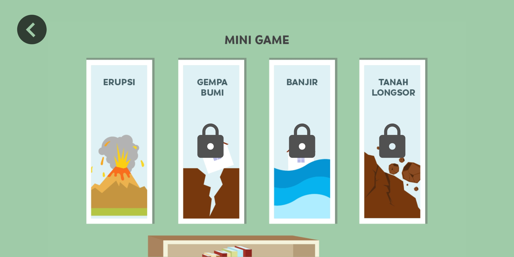
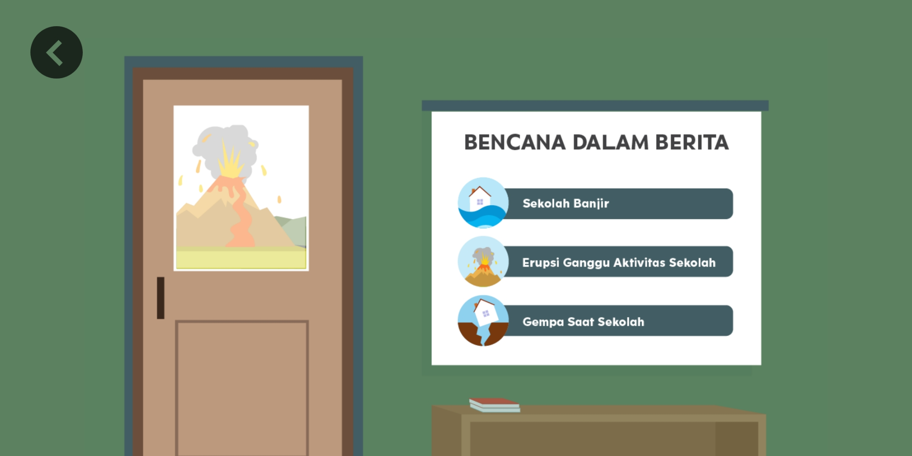
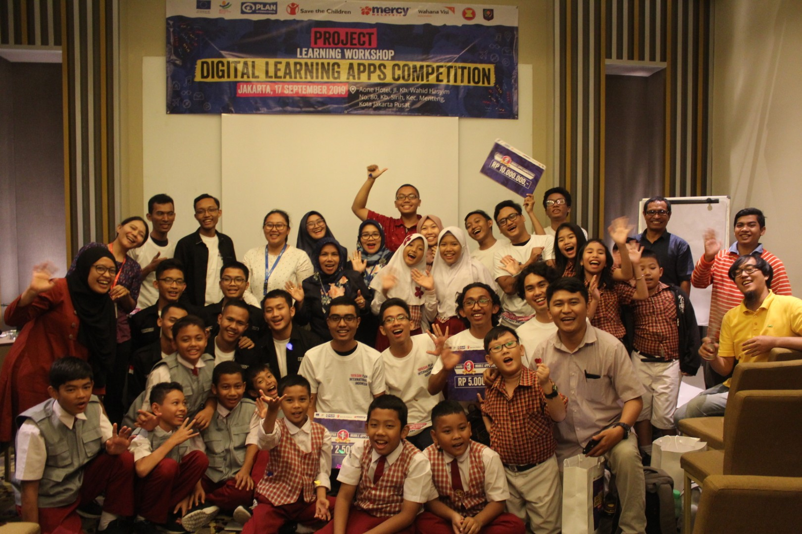
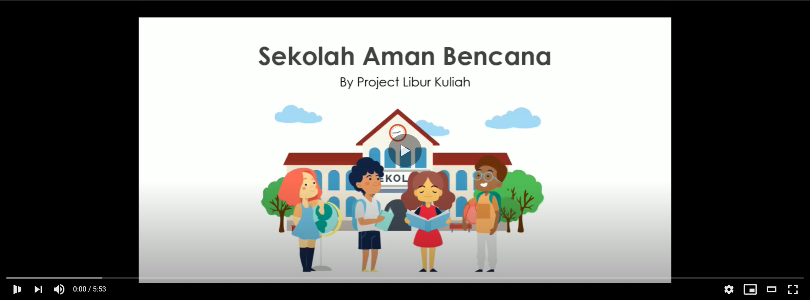

# Sekolah Aman Bencana
 Sekolah Aman Bencana adalah aplikasi berbasis mobile yang berisi pengetahuan dasar mengenai sekolah aman, pengetahuan mengenai bencana, dan pengetahuan mengenai tiga pilar sekolah aman.  
 Terdapat empat bencana yang dirangkum di dalam aplikasi ini yaitu erupsi, gempa bumi, banjir, dan tanah longsor. Informasi yang ada disampaikan secara interaktif, komunikatif, dan edukatif sehingga diharapkan dapat dengan mudah dipahami oleh pengguna terkhusus anak-anak.
 
#### Unduh aplikasi Sekolah Aman Bencana <a href="https://play.google.com/store/apps/details?id=com.projectliburkuliah.sekolahamanbencana" ><b>disini</b></a>

 ## Author
 <a href="https://github.com/adhytianara" >Muhamad Adhytia Wana Putra Rahmadhan - Universitas Indonesia</a>  
 <a href="https://github.com/ajieno" >Ajie Nofrizan - Universitas Bengkulu</a>  
 <a href="https://github.com/sahrialihsani" >Sahrial Ihsani Ishak - Universitas Bengkulu</a>
 
 ## Fitur Aplikasi
* **Materi Interaktif**  
	Menampilkan rangkuman materi terkait sekolah aman, tiga pilar sekolah aman, penjelasan empat jenis bencana, dan penjelasan penyebab dari bencana-bencana tersebut. 
  Setelah selesai membaca, akan ada mini kuis yang menguji pemahaman pengguna terkait materi yang baru saja ditampilkan.  
  
* **Games**  
  Menyajikan empat jenis game yang masing-masing game nya membawa tema bencana alam yang berbeda. Games ini terdiri atas :
  * Erupsi? : Mengangkat mengenai bencana alam erupsi gunung meletus
  * Tebak kata : Mengangkat tema gempa bumi
  * Short Quiz : Mengangkat tema banjir
  * Tebak Gambar : Mengangkat tema tanah longsor   
    
  
  
* **Bencana dalam Berita**  
  Menampilkan halaman interaktif terkait hal-hal yang perlu dilakukan saat terjadi bencana. 
  Selain itu, fitur ini juga dapat mengarahkan pengguna ke halaman browser yang kata kunci nya telah diatur tentang bencana alam agar dapat memperoleh pengetahuan yang lebih mendalam
    
  

  
 ## Catatan
 Aplikasi ini dibuat dalam rangka mengikuti Mobile Apps Competition yang diselenggarakan oleh Yayasan Plan International Indonesia.  
 Kegiatan perlombaan dilakukan pada bulan Agustus-September 2019 pada saat pengembang menjalani libur perkuliahan semester 2.  
 Setelah perlombaan selesai, tidak ada perubahan berarti yang diimplementasikan lagi pada aplikasi  
   
 
 
 ## Demo
 Tonton videonya <a href="https://youtu.be/tju1JBnC7CA" ><b>disini</b></a>
 
 
 ## Screenshot
 Screenshot lebih lengkap dari aplikasi dapat dilihat di dalam <a href="https://github.com/adhytianara/SekolahAmanBencana/tree/master/images" >folder images</a>
